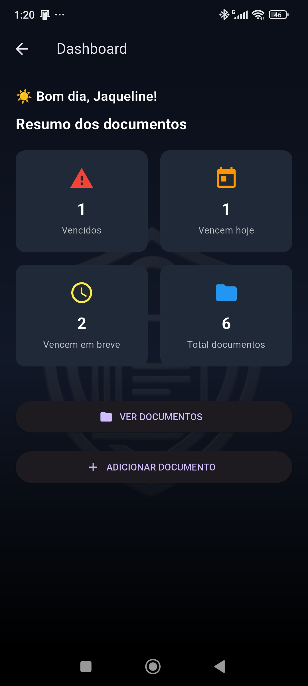
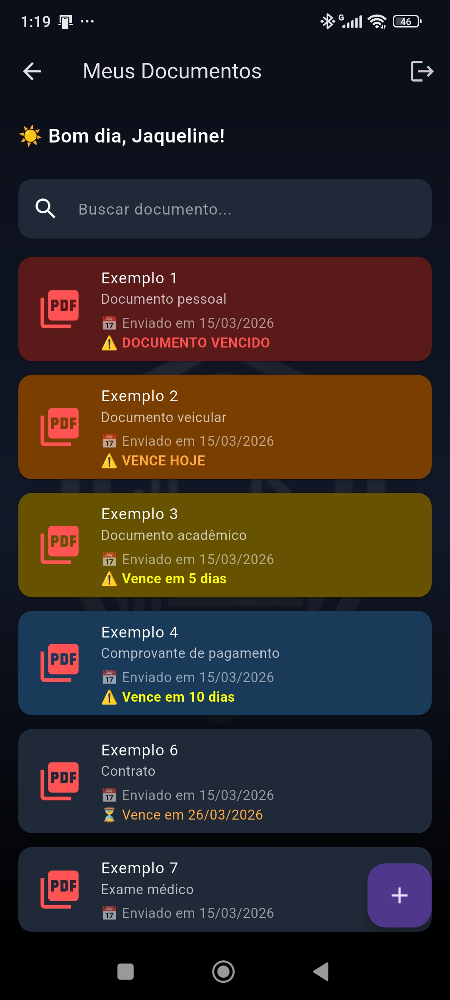
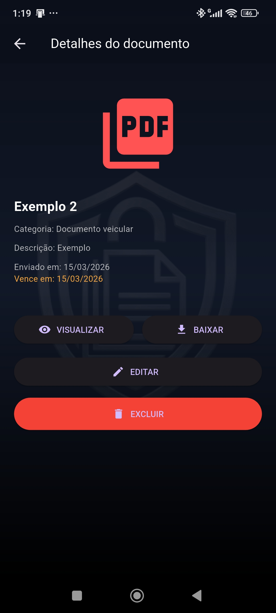

# 📄 DocDigital - Mobile App


Aplicativo mobile desenvolvido em *Flutter* para *digitalização, armazenamento e gerenciamento de documentos pessoais*, com alerta automático de vencimento e organização por categorias.

O objetivo do projeto é facilitar o acesso e organização de documentos importantes diretamente no celular, evitando perda de prazos e facilitando o controle de documentos pessoais.

---

# 📱 Demonstração

| Dashboard | Lista de documentos | Detalhes |
|-----------|--------------------|----------|
|  |  |  |


---

# 🚀 Funcionalidades

✔ Cadastro de usuário  
✔ Login com autenticação JWT  
✔ Upload de documentos (PDF ou imagem)  
✔ Digitalização de documentos pela câmera  
✔ Visualização de documentos  
✔ Organização por categorias  
✔ Busca por documentos  
✔ Alertas de vencimento  
✔ Notificações automáticas de vencimento  
✔ Dashboard com resumo de documentos  

---

# 🛠 Tecnologias Utilizadas

### Frontend

- Flutter
- Dart

### Bibliotecas Flutter

- http
- flutter_secure_storage
- flutter_local_notifications
- image_picker
- cunning_document_scanner
- path_provider

### Backend (API)

O aplicativo consome uma API desenvolvida em:

- Java
- Spring Boot
- PostgreSQL
- JWT Authentication

Repositório da API:

https://github.com/jaquedb/docdigital-api.git

# 🏗 Arquitetura do Projeto

O projeto segue uma arquitetura modular baseada em camadas:
```
lib/
├── config
│   └── api_config.dart
│
├── models
│   └── documento.dart
│
├── screens
│   ├── login_screen.dart
│   ├── register_screen.dart
│   ├── dashboard_screen.dart
│   ├── document_list_screen.dart
│   └── document_detail_screen.dart
│
├── services
│   ├── auth_service.dart
│   ├── document_service.dart
│   ├── token_storage.dart
│   └── notification_service.dart
│
├── utils
│   └── categoria_utils.dart
│
├── widgets
│   └── app_background.dart
│
└── main.dart
```

### Organização

| Pasta | Responsabilidade |
|------|------------------|
| config | Configurações da aplicação |
| models | Modelos de dados |
| screens | Telas do aplicativo |
| services | Comunicação com API |
| utils | Funções auxiliares |
| widgets | Componentes reutilizáveis |

---

# ⚙️ Configuração do Projeto

## 1️⃣ Clonar o repositório

```
git clone https://github.com/jaquedb/docdigital-app.git 
```

## 2️⃣ Entrar na pasta do projeto

```
cd docdigital-app
```


---

## 3️⃣ Instalar dependências

Execute o comando abaixo para instalar todas as dependências do projeto:

```
flutter pub get
```


---

## 4️⃣ Configurar a URL da API

Antes de executar o aplicativo, é necessário configurar a URL do backend.

Abra o arquivo:

```
lib/config/api_config.dart
```


Edite a variável baseUrl com o endereço do backend.

Exemplo:

```dart
class ApiConfig {

  static const String baseUrl = "http://192.168.X.X:8080";

}
```


Substitua 192.168.X.X pelo IP da máquina onde o backend está rodando.

---

## ▶️ Executar o projeto

Para executar o aplicativo em um emulador ou dispositivo físico:

```bash
flutter run
```


---

## 📦 Gerar APK

Para gerar o arquivo APK do aplicativo:

```bash
flutter build apk --release
```


Após executar o comando, o APK será gerado em:

```
build/app/outputs/flutter-apk/app-release.apk
```


Esse arquivo pode ser instalado diretamente em um dispositivo Android.

---

## 🔔 Sistema de Notificações

O aplicativo possui um sistema de notificações locais que alerta o usuário quando um documento:

- está vencido
- vence no dia atual
- está próximo do vencimento

As notificações são gerenciadas pelo serviço:

```
lib/services/notification_service.dart
```


---

## 📂 Armazenamento Seguro

O token de autenticação do usuário é armazenado de forma segura utilizando a biblioteca:

```
flutter_secure_storage
```


O armazenamento e recuperação do token são gerenciados pelo serviço:

```
lib/services/token_storage.dart
```


---

## 🔐 Autenticação

O sistema utiliza autenticação baseada em *JWT (JSON Web Token)*.

Fluxo de autenticação:

```
Login do usuário
        ↓
Backend gera token JWT
        ↓
Aplicativo salva o token no Secure Storage
        ↓
Token é enviado em todas as requisições protegidas
```


---

## 📊 Dashboard

A tela inicial do aplicativo apresenta um resumo geral dos documentos do usuário, incluindo:

- documentos vencidos
- documentos que vencem hoje
- documentos que vencem em breve
- total de documentos cadastrados

Esse resumo permite ao usuário visualizar rapidamente a situação de seus documentos.

---

## 📌 Roadmap

Funcionalidades planejadas para versões futuras do aplicativo:

- backup automático em nuvem
- reconhecimento de texto (OCR)
- compartilhamento de documentos
- autenticação biométrica
- exportação de documentos
- organização avançada por etiquetas

---

## 👩‍💻 Autora

*Jaqueline Dias*

Estudante de Análise e Desenvolvimento de Sistemas.

GitHub:

```
https://github.com/jaquedb
```


---

## 📄 Licença

Este projeto está licenciado sob a licença MIT.

```
MIT License
```


---

## ⭐ Contribuição

Contribuições são bem-vindas.

Para contribuir com o projeto:

1. Faça um fork do repositório
2. Crie uma nova branch
3. Realize as alterações
4. Envie um Pull Request
